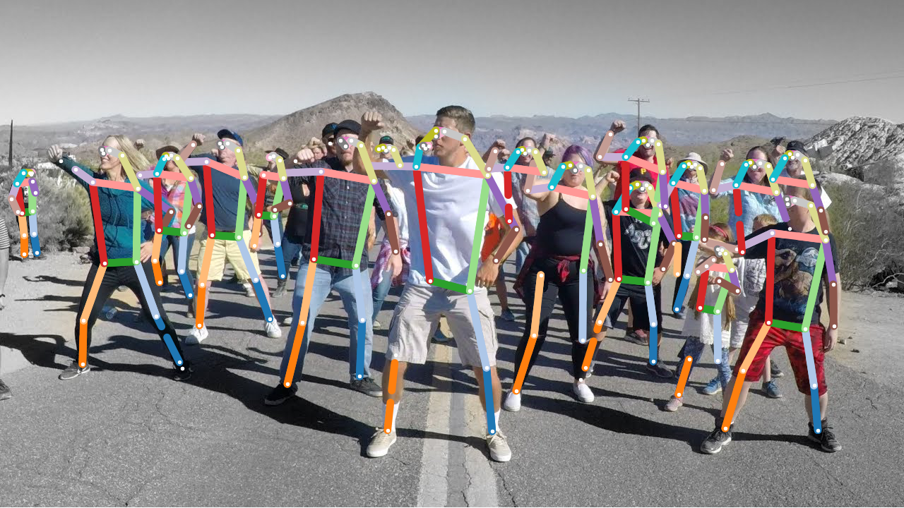
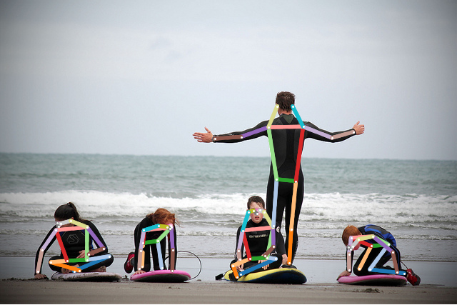

# OpenPifPaf port for RunwayML

[](https://open-app.runwayml.com/?model=alexandre01/OpenPifPaf-Pose)





Link to OpenPifPaf code: [OpenPifPaf](https://github.com/vita-epfl/openpifpaf)

```
@article{kreiss2019pifpaf,
  title={PifPaf: Composite Fields for Human Pose Estimation},
  author={Kreiss, Sven and Bertoni, Lorenzo and Alahi, Alexandre},
  journal={CVPR, arXiv preprint arXiv:1903.06593},
  year={2019}
}
```
